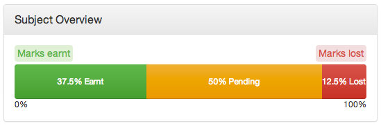

SubjectMarks
============

Browser-based subject results distribution visualiser.

Based off my University's marking distribution, but no doubt applicable to many others.

#How it works

Enter the marks you've received for a subject and how much each assessment item is worth and you'll get a lovely progress bar showing you how many marks you've earnt and lost

e.g.:

#How to use

* Run it [here](http://nuclearpidgeon.github.io/SubjectMarks/) thanks to GitHub Pages!
* Or you can download it yourself if you want to, then open `index.html` in your web browser of choice ([that isn't Internet Explorer](http://toastytech.com/evil/ "plz don't use Internet Explorer you'll make me cry"))

# Credits/Frameworks used
* Uses [knockoutjs](http://knockoutjs.com/ "^ Sexy! ^") for automatic UI updating on data changing.
* Uses [flot](www.flotcharts.org "Charty!") (specifically [this pie-chart example](www.flotcharts.org/flot/examples/series-pie/index.html)) for the piechart (hoping to switch to pure d3 though)
* Uses a lot of [bootstrap](http://getbootstrap.com)
